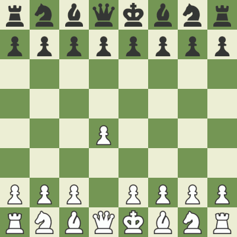

# Chess.com Metrics Collector


**Table of Contents**

- [Introduction](#introduction)
- [Considerations on Web Scraping](#considerations-on-web-scraping)
- [Usage](#usage)
- [Additional functionalities](#additional-functionalities)
- [Disclaimer](#disclaimer)

## Introduction
This tool is designed to collect game metrics from Chess.com, aiding players in better understanding their performance. By analyzing games manually, it provides insights without the need for premium features.

## Considerations on Web Scraping

It's important to understand the ethical and legal aspects of web scraping. This tool was specifically developed to analyze games on Chess.com without bypassing any paid features. However, it should be noted that web scraping without permission or against a website's terms of service can be a breach of legal or ethical standards.

**NOTE:** This tool should *NOT* be modified to take in advantage during live games. All metrics are meant to be collected post-game and then uploaded to the designated server for proper analysis.



## Usage

1. Make sure you have completed a game on Chess.com.
2. Install necessary dependencies:
```
pip install -r requirements.txt
```
3. Make sure you have a compatible Chess engine installed in the same directory (e.g stockfish). Checkout `https://stockfishchess.org/download/`
4. Wait for the game to complete. Select your preferred browser and install the corresponding webdriver. For Chrome, for example, visit `https://chromedriver.chromium.org/downloads`. You'll have to set the webdriver path in `api.py`.
5. Launch the tool and execute:
```
python api.py
```
7. Your game will be recorded into a file called `games.txt`. Next versions of this bot will auto analyze games in that file to give powerful insights. Coming soon!

### Example of `games.txt`:
```
GAME: 1. e4 e5 2. Nf3 Nc6 3. Bc4 g6 4. c3 Bg7 5. d4 d6 6. O-O Qe7 7. Re1 Nf6 8. Nbd2 O-O 9. b4 Bd7 10. a4 Rae8 11. b5 Na5 12. dxe5 dxe5 13. Ba3 Qd8 14. Bxf8 Bxf8 15. Ba2 h6 16. Nb3 Nxb3 17. Qxb3 Be6 18. Qb2 Nh5 19. Bxe6 Rxe6 20. Rad1 Qf6 21. Rd7 Bd6 22. Qb3 Nf4 23. Qc4 b6 24. g3 Nh5 25. Kg2 g5 26. Rd1 Qg6 27. a5 Ng7 28. a6 Nh5 29. R7xd6 Rxd6 30. Nxe5 Qf6 31. Rxd6 cxd6 32. Nc6 g4 33. Qd3 Qe6 34. Nxa7 Nf6 35. Nc6 Nxe4 36. a7 Nc5 37. Qe3 Qd5+ 38. Kg1 Qd1+ 39. Kg2 Qd5+ 40. f3 Qa2+ 41. Qf2 gxf3+ 42. Kxf3 Qd5+ 43. Kg4 h5+ 44. Kh4 Ne4 45. a8=Q Kg7+ 46. Qf4 Nf6 47. Qg5 Qxg5+
GAME: 1. d4 d5 2. Nf3 Nf6 3. e3 c5 4. dxc5 e6 5. b4 a5 6. b5 Bxc5 7. Bb2 O-O 8. Be2 b6 9. Nbd2 Bd7 10. a4 h6 11. c4 Bc8 12. Ne5 Bb7 13. O-O Nbd7 14. Nc6 Bxc6 15. bxc6 Nb8 16. c7 Qxc7 17. Bxf6 gxf6 18. cxd5 exd5 19. Rc1 Nc6 20. Nb3 Ne7 21. Bd3 Rac8 22. Qg4 Kh8+ 23. Nd4 Rg8 24. Qh3 Kg7 25. Ne2 Qe5 26. Ng3 Rc6 27. Nf5 Nxf5+ 28. Bxf5 Rd6 29. Kh1 Rh8 30. Qg4 Kf8+ 31. Qh5 d4 32. exd4 Qxd4 33. Qe2 Qxa4 34. Rfe1 Kg7 35. Rc4 Qc6 36. Rg4 Kf8+ 37. Qe7#
GAME: 1. c4 e5 2. Nc3 Nf6 3. d3 d5 4. cxd5 Nxd5 5. Nf3 Nc6 6. e4 Nf6 7. h3 Bb4 8. Be2 O-O 9. O-O Re8 10. Bg5 h6 11. Bxf6 Qxf6 12. Nd5 Qd6 13. Rc1 Be6 14. Nxb4 Qxb4 15. a3 Qxb2 16. Rb1 Qxa3 17. Rxb7 Qa2 18. Rxc7 Rec8 19. Rxc6 Rxc6 20. Nxe5 Rc2 21. Bg4 Bxg4 22. Qxg4 Qb2 23. Nc4 Qc3 24. Qd7 Rc1 25. g3 Rxf1+ 26. Kxf1 a5 27. Qd5 Rb8 28. Nxa5 Rb1+ 29. Kg2 Qe1 30. Kf3 Qd1+ 31. Ke3 Rb2 32. Nc4 Qe2+ 33. Kd4 Qxf2+ 34. Kc3 Rc2+ 35. Kb3 Rc1 36. Qa8 Kh7+ 37. Qd5 Qa7 38. Qf5 g6+ 39. Qa5 Qb7+ 40. Ka2 Qb1+ 41. Ka3 Rc3+ 42. Qxc3 Qb7 43. Ne5 Qe7+ 44. Kb2 Qb7+ 45. Kc2 Qe7 46. Ng4 Qg5 47. Nf6 Kg7+ 48. Nd7+
```


## Additional functionalities
To use for Streamlabs or OBS, retrieve chess.com live ratings with the command:
```
python retrieveRating.py user1 user2 user3
```

## Disclaimer

This tool is for personal use only. Any misuse, especially during live games, can result in the suspension or banning of your Chess.com account. Always respect Chess.com's terms of service and ensure you're not infringing on any rights.
